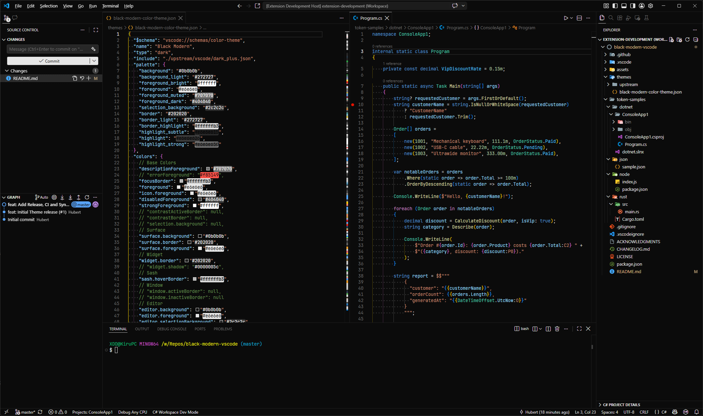

  
  <h1>Black Modern</h1>
  
A monochrome, near-black VS Code theme inspired by <a href="https://community.obsidian.md/themes/void">Obsidian's Void</a>, paired with Dark Modern syntax colors.

## Color palette

The exact UI palette is defined in the [`"palette"`](./themes/black-modern-color-theme.json) object. It is based on [Void for Obsidian](https://community.obsidian.md/themes/void) by [@0Crazy-0](https://github.com/0Crazy-0).

Syntax/token highlighting comes from VS Code's [Dark+ theme](./themes/upstream/vscode/dark_plus.json), which also serves as the base for Dark Modern.

## Installation

- Install from the VS Code Marketplace: [Black Modern Monochrome](https://marketplace.visualstudio.com/items?itemName=Kiruyuto.black-modern-vscode)
- Install using the CLI: `code --install-extension Kiruyuto.black-modern-vscode`
- Build from source: With [`@vscode/vsce`](https://github.com/microsoft/vscode-vsce) installed, clone this repository and run `vsce package` to generate a `.vsix` file then install it from the Extensions view. See the [official packaging guide](https://code.visualstudio.com/api/working-with-extensions/publishing-extension#packaging-extensions) for more details.

## Acknowledgments

See [ACKNOWLEDGMENTS](./ACKNOWLEDGMENTS) for third-party credits and notices.

## License

Licensed under the [MIT License](./LICENSE).
